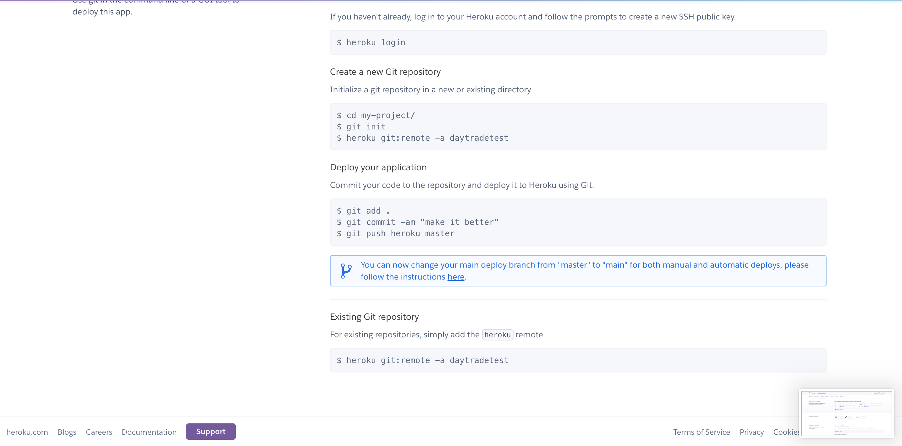

# dayTradeOANDA

# step 1
  ## create a google accout and set the gmail app password 
      follow the below steps and get the app password
      https://support.google.com/mail/answer/185833?hl=ja#zippy=
# step 2
  ## create a new heroku accout
  
  
  
  
  
  
  
  
  
  
  
  
  check the info for your database
  
  
# step 3 
  ## create your oanda api for practice
  check the access-token and account ID
  
# step 4 
  ## clone this repo and change the variables in constVariables.py
  
# step 5
  ## push the updated app to the heroku 
  type the below commands
  
# Done! Now you are all set!
