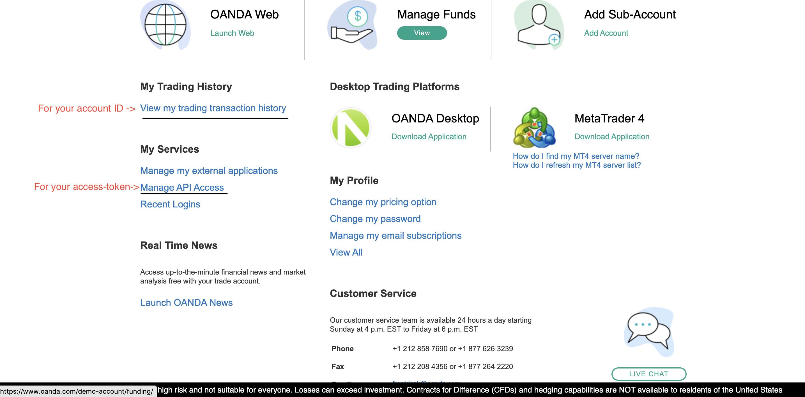

# dayTradeOANDA

# step 1
  ## create a google accout and set the gmail app password 
      follow the below steps and get the app password
      https://support.google.com/mail/answer/185833?hl=ja#zippy=
# step 2
  ### create a new heroku accout
  #### 1
  
  #### 2
  
  
  ### add the database on your app
  #### 1
  
  
  
  #### 2
  
  
  
  #### 3
  
  
  
  #### 4
  
  
  
  #### 5
  
  
  
  #### 6
  
  
  ### check the info for your database
  
  
# step 3 
  ## create your oanda api for practice(https://www1.oanda.com/)
  ### check the access-token and account ID
  
# step 4 
  ## clone this repo and change the variables in constVariables.py
  ### constVariables.py
  
  
# step 5
  ## push the updated app to the heroku 
  ### type the below commands
  
# Done! Now you are all set!
